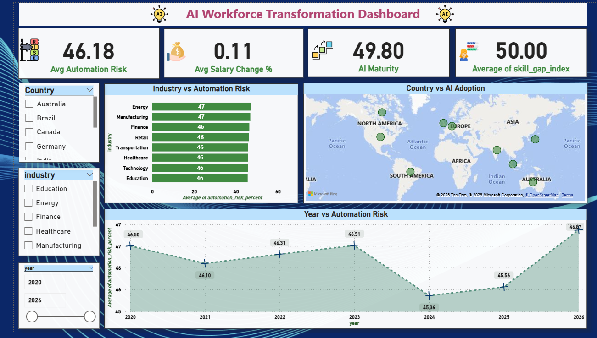

# 🤖 AI Adoption & Workforce Impact Dashboard

## 📊 Project Overview
This Power BI dashboard analyzes the impact of AI adoption across industries focusing on:
- Automation Risk
- Salary Growth
- Workforce Skills
- Industry AI Readiness

## 🚀 Tools Used
- Power BI
- CSV
- Data Modeling
- DAX
- Data Visualization

  ## 📷 Dashboard Preview

### AI Workforce Transformation Dashboard(1)

## 📈 Key Insights
- AI adoption drives industry-wide workforce transformation.
- Higher AI maturity reduces automation risk and stabilizes salaries.
- Skill demand growth accelerated significantly after 2022.
- Remote-ready industries show stronger employment sustainability.
- Workforce upskilling is critical to mitigating automation impact.

## 📂 Files Included
- AI_Dashboard.pbix
- AI_Dataset
- Dashboard Screenshots

## 👩‍💻 Author
Vaishnavi Vaghmare
